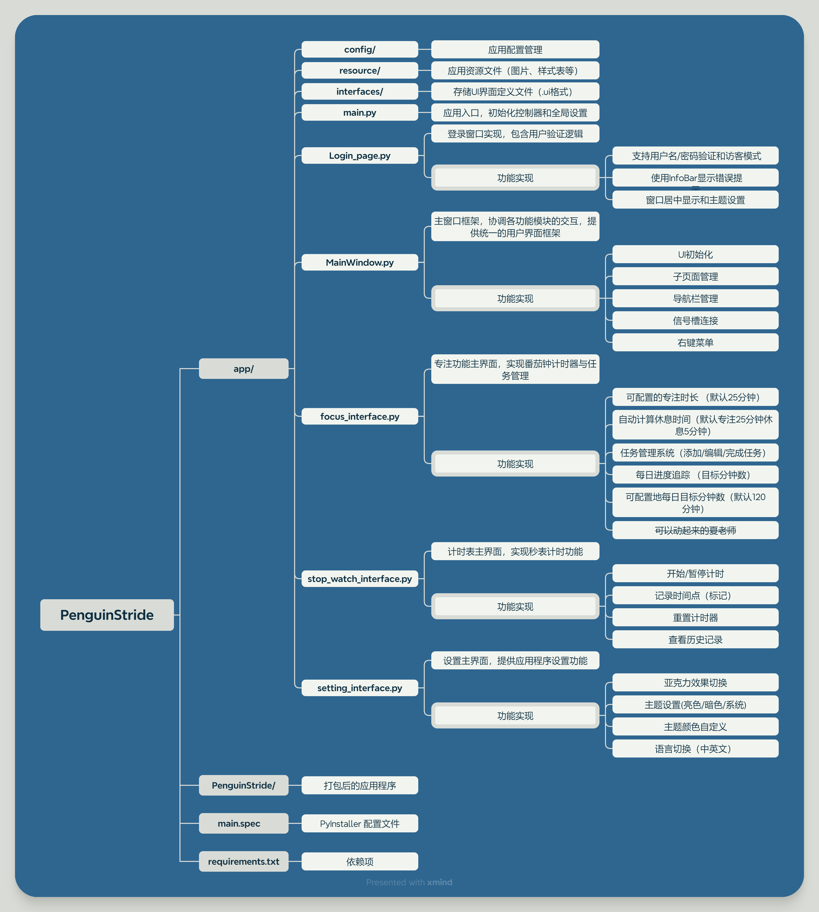

# PenguinStride
> Penguin Stride是一个基于PyQt6和QFluentWidgets库的现代化桌面应用程序。


## 🌟功能特性
- 用户登录系统（Log In）
- 专注界面（Focus Time）
- 计时器界面（Stop Watch）
- 个性化设置（Setting）

## 📦项目结构


---
## 🧪安装指南
1. 确保已安装Python 3.11.x
2. 安装依赖:
```bash
pip install -r requirements.txt
```
3. 运行应用程序:
```bash
python app/main.py
```
4. 打包应用程序:
```bash
pyinstaller main.spec
```
## 使用说明
1. 启动应用程序后显示登录界面
2. 支持访客模式或用户名/密码登录（开发环境默认账户：jojo / 123456，可在[Login_page.py](app\Login_page.py) 中修改）
3. 主界面提供专注、秒表和设置三个主要功能
4. 可通过导航栏切换功能模块

## 扩展说明
- 通过修改 [config.json](app\config\config.json) 可调整默认配置
- 通过编辑 .ui 文件可修改界面布局
- 通过扩展 [MainWindow.py](app\MainWindow.py) 可以添加新界面 

## 视频展示
（To be continued...）

## 🤝 致谢
  请支持 [QFluentWidgets](https://github.com/zhiyiYo/PyQt-Fluent-Widgets)
